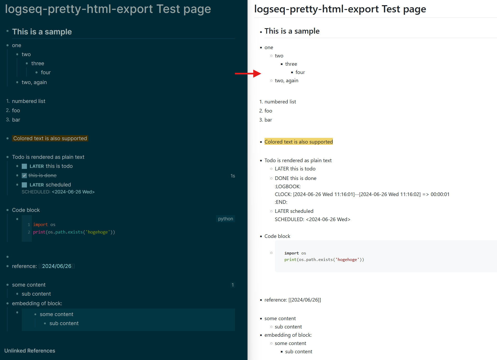

# logseq-pretty-html-export

A plugin to export a Logseq page to pretty HTML file.

## Example

## Usage

1. Open a Logseq page you want to export.
2. Push `pretty-html-export` button in the toolbar.
    - If you don't see the button, you can enable it by clicking the plugin icon.

## Features

- Support some of the Logseq syntax.
- Fully editable HTML template.
    - You can edit the template in the plugin settings.

